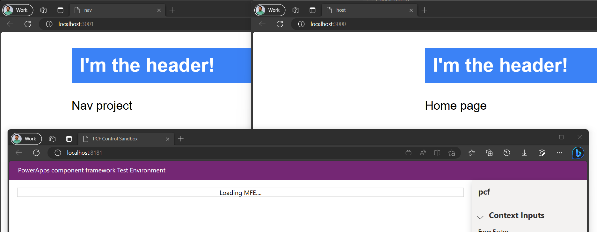
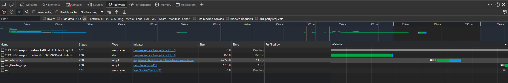

# Module Federation with PowerApp component framework

 *TL;DR
PCF control that renders a remote (federated) React component*

## Disclaimer

This is a getting started playground for experimentation with module federation in PowerApps compoment framework. This is **not** production code. Security has not been a consideration in this project but rather exploration of the art of possible.
Improvement ideas welcome!

## Credits

Getting started project based on [practical module federation repository.](https://github.com/jherr/practical-module-federation-20/tree/8476ccba4fda513c5d67aeaa5949941644598f69/part1-getting-started/getting-started).


## Setup & run

Install npm packages and components, start/debug the app (e.g. pcf -> package.json)



The remote module in a React component (ReactHostComponent) is loaded using the @angular-architects/module-federation package (network traffic below):




## Key Components

### Header (nav) 

The `Header` component in the **nav** remote is a functional component that renders a sample HTML 'header'. It is exported as the default export of the module via `ModuleFederationPlugin` (`webpack.config.js`).


### index.ts

TypeScript file that defines a PowerApps Component Framework (PCF) control. The control is defined as a class called **pcf** that implements the ComponentFramework.StandardControl interface.


### pcf

The init method is called when the control is initialized and sets the `_container` property to the container element that the control will render into. The `updateView` method is called when the control needs to update its view and uses the `createRoot` function from the `react-dom/client` package to create a root element for the React component. 


### ReactHostComponent

The component has a state object that contains a Component property. In the `componentDidMount` lifecycle method, the `loadRemoteModule` function (from the @angular-architects/module-federation package) is used to load a remote module (Header) from a federated plugin (nav). 

```
 loadRemoteModule({
            remoteEntry: 'http://localhost:3001/remoteEntry.js',
            remoteName: 'nav',
            exposedModule: './Header',
```

Once loaded, the default export of the module is assigned to the Component property of the component's state object. This causes the component to re-render with the loaded component. `React.Suspense` component to handle the loading state


## Resources

- https://github.com/module-federation/module-federation-examples

- https://powerapps.microsoft.com/en-us/blog/virtual-code-components-for-power-apps-using-react-and-fluent-ui-react-platform-libraries/

- https://blog.thenetw.org/2019/06/06/getting-react-and-office-ui-fabric-work-with-powerapps-component-framework/

- https://learn.microsoft.com/en-us/power-apps/developer/component-framework/react-controls-platform-libraries

- https://github.com/module-federation/module-federation-examples/issues/681

